This module is an attempt to reproduce the functionality of the Intellijel Quadratt for private use (not for sale!), i.e. four independent attenuators/attenuverters, which can be mixed together through normalized mixing, although some modifications are included regarding output LEDs and jack input normalization. The schematics are fairly straightforward and consists mainly of usual inverting opamp mixing stages. Aside from having a new utility module at hand, the main goal of this project was to have a relatively simple module with which I can make my first experiences with SMD-components, SMD-assembly services and 4-layer-PCB-design.

# Picdump

front panel
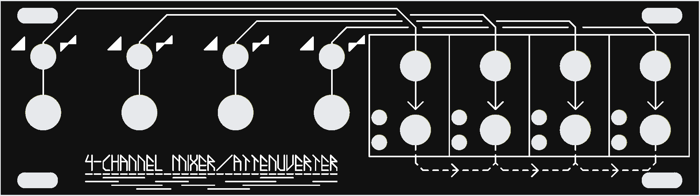

layout top
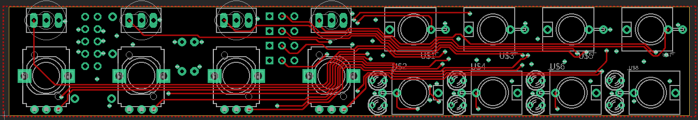

layout bottom
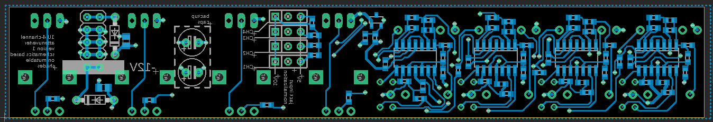

layout power layer
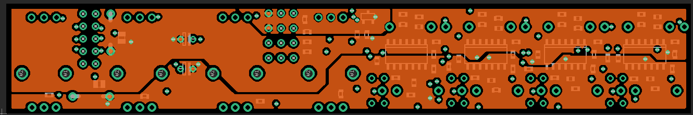

schematics
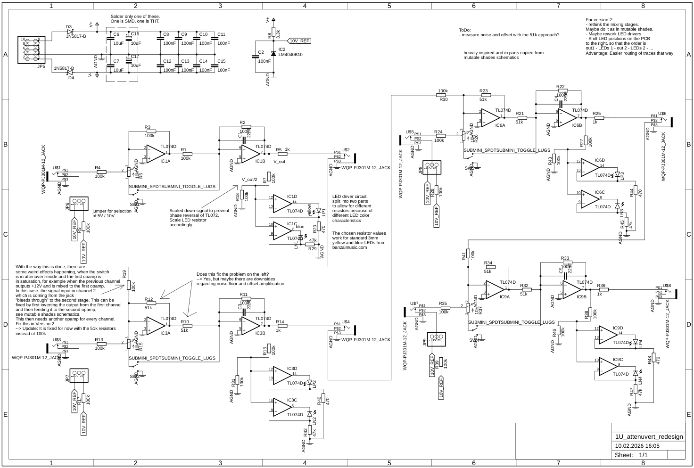

# Circuit Explanation

The circuit consists of four nearly identical attenuverter cores in the following configuration: 

Each attenuverter core can be switched between attenuator (Gain ranging from 0 to 1) and attenuverter (Gain ranging from -1 to 1) modes. Each input is normalized to +5V or +10V, see the section about input normalization below. If no cable is plugged in the output of its respective channel, the output signal is automatically mixed to the next channel, see the section about output normalization in the documentation.

# [Click here for a detailed analysis of the circuit!](./docu/docu.pdf)

<!-- ## Attenuverter Core Circuit

### Inverting OPamp stages

The core circuit for each channel consists of two unity gain inverting amplifier stages, i.e. stages with a gain of -1. Quick reminder about the golden rules for opamps with negative feedback: Rule 1 states that the opamp will make it so that its two input nodes have the same potential. Rule 2 states that no current can flow into the opamp. With this in mind, the inverting amplifier works as follows:
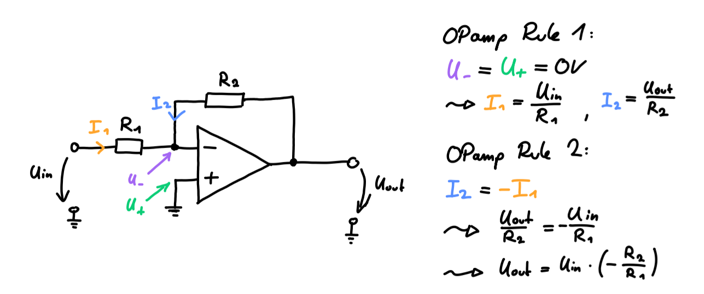

With this we arrive at:
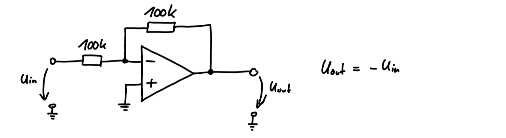

For having not only a fixed gain of -1 but make it adjustable, one can insert a potentiometer as follows:

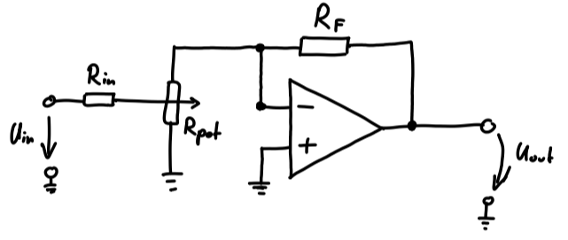

In this case, the potentiometer is of course nothing else than two resistors $R_1, R_2$ with $R_{pot} = R_1+R_2$, where $R_{pot}$ is the total resistance of the pot:

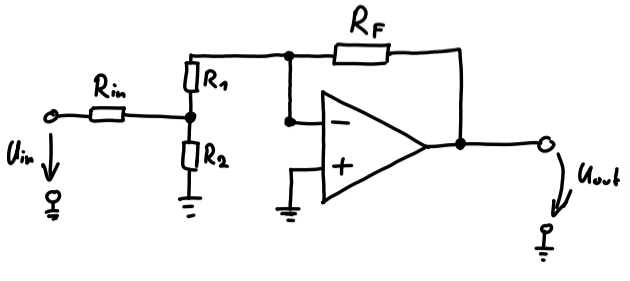

As before, by using the opamp rules, this can be analyzed to arrive at a general more general formula for the gain of the circuit. First note, that because of "virtual ground" at the negative terminal of the opamp, $R_1$ and $R_2$ form a current divider as follows:

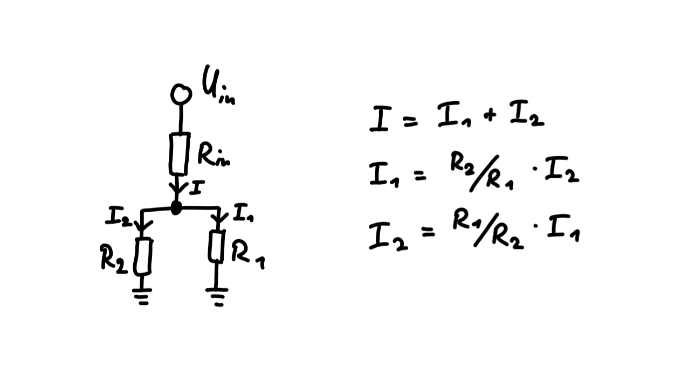

Solving for $I_1,$ we obtain
$$ I_1 = I - I_2 = I - \frac{R_1}{R_2}\cdot I_1, $$
hence
$$ I = I_1+\frac{R_1}{R_2}\cdot I_1 = (1+\frac{R_1}{R_2})\cdot I_1 $$
and thus 
$$ I_1 = \frac{I}{1+ \frac{R_1}{R_2}}. $$
Writing $R_1||R_2$ for the resistance of $R_1$ parallel to $R_2,$ the total current $I$ is given by
$$ I = \frac{U_{in}}{R_{in} + (R_1||R_2)} = \frac{U_{in}}{R_{in} + \frac{1}{\frac{1}{R_1}+\frac{1}{R_2}}}.$$
This leads to
$$\begin{align*} 
    I_1 &= I\cdot \frac{1}{1+ \frac{R_1}{R_2}} \\
    &= \frac{U_{in}}{R_{in} + \frac{1}{\frac{1}{R_1}+\frac{1}{R_2}}}\cdot \frac{1}{1+ \frac{R_1}{R_2}}\\
    &= \frac{U_{in}}{R_{in} + \frac{R_1R_2}{R_1+R_2}}\cdot \frac{R_2}{R_2+ R_1}\\
    &= \frac{U_{in}R_2}{R_{in}(R_2+R_1) + R_1R_2} \\
    &= \frac{U_{in}R_2}{R_{in}R_{pot} + R_1R_2}
\end{align*}$$
remembering that $R_{pot} = R_2 + R_1$. Again we have $U_{out} = -I_1\cdot R_F$ by inverting opamp amplifier rules and thus arrive at the general formula
$$ U_{out} = -U_{in}\cdot \frac{R_2R_F}{R_{in}R_{pot} + R_1R_2}. $$
Ideally, we would want to have a linear relationship between potentiometer position, i.e. the value of $R_2$, and gain of our circuit. But considering $R_2$ as the parameter of the gain function $f$, i.e.
$$ f(R_2) = - \frac{R_2R_F}{R_{in}R_{pot} + R_1R_2}, $$
this looks all but linear! Luckily, we can make some assumptions, because of course in reality we don't care if it is really mathematically linear or only "linear enough". If we assume for now, that $R_{in}$ is much bigger than $R_{pot},$ then since both $R_1\leq R_{pot}<<R_{in}$ and $R_2\leq R_{pot}<<R_{in},$ we can approximate
$$ R_{in}R_{pot} + R_1R_2 \approx R_{in}R_{pot}. $$
If we further say that $R_{in} = R_F$ (in practice we choose 100k for both), the gain function simplifies to 
$$ f(R_2) \approx \frac{R_2}{R_{pot}}, $$ 
which is linear! Or in other words $U_{out}\approx -U_{in}\cdot \frac{R_2}{R_{pot}}$

So, what value do we choose for $R_{pot}$? The following plots show the gain $-{U_{out}}/{U_{in}}$ of the circuit for different values of $R_{pot}$ and we can easily see that a value of 10k leads to "linear enough".

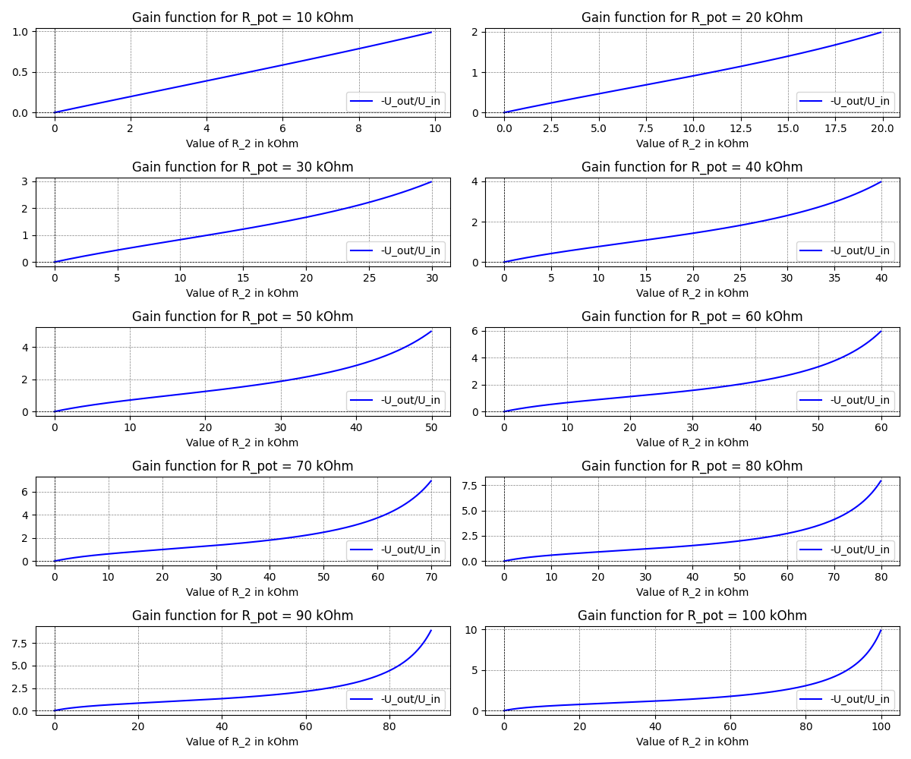

We close this section with an inverting mixer configuration. It's basically the same as before, but with multiple input voltages and corresponding resistors (Remember that no current can flow inside of the opamp):

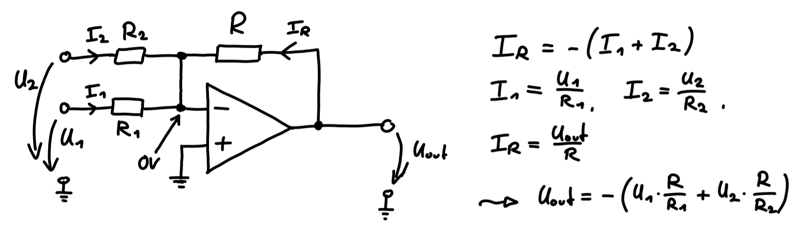

So we see, that the output is just an inverted copy of the sum of the two input voltages, but each input scaled acoordingly by $R_1$ and $R_2$ respectively.

### Attenuator / Attenuverter Circuit

Now we come to the actual attenuverter core. Let's have a look at the attenuverter circuit for channel 1:

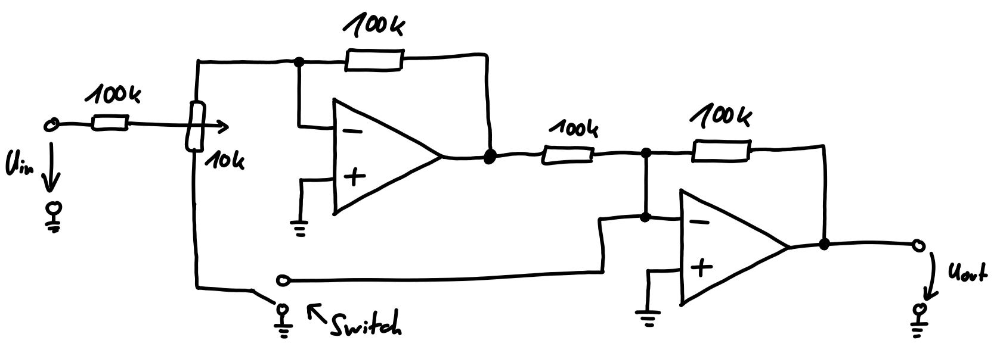

If the switch connects to ground as in the picture, the situation is exactly as explained before; The first opamp outputs $-U_{in}\cdot c,$ where $c$ is a value between 0 and 1, depending on the pot position (this is approximately $R_2/R_{pot}$ as in the previous section). The next opamp has a gain of $-1$, so the total output is $U_{out} = c\cdot U_{in}.$ Attenuation achieved!

Now assume the switch is in the other position, i.e. one side of the potentiometer is connected to the negative terminal of the second opamp. Since both sides of the potentiometer are connected to input terminals of opamps, they both sit at "virtual ground" aka 0V. Let's analyze some concrete potentiometer positions:

- Pot fully turned clockwise:
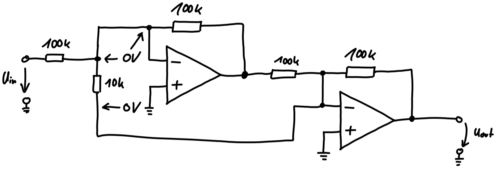
Both ends of the potentiometer sit at 0V, no current flows through the pot, so the first opamp outputs $-U_{in}$ and the second one inverts it again, arriving at $U_{out} = U_{in}.$
- Pot in middle position:
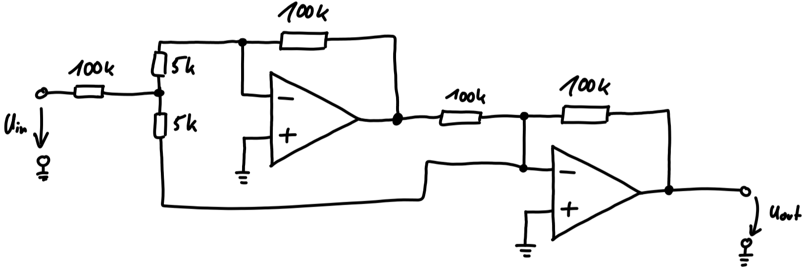
As before, the pot divides the current, so roughly half of the input current flow through either side of the pot. The first opamp then outputs roughly $\approx -0.5\cdot U_{in}$. This again forces a negative to current through the 100k-resistor connecting the first opamp to the second one, which then cancels with the current coming from the lower part of the pot. Total output: 0V 
- Pot fully turned counterclockwise:
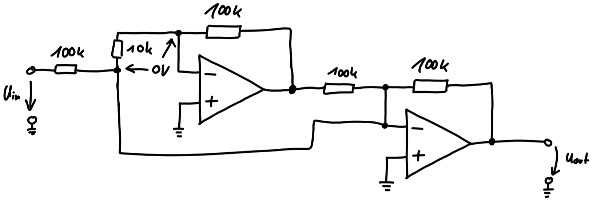
Again both ends of the potentiometer sit at 0V, so all input current has to flow to the second opamp, which inverts the signal, so we arrive at $U_{out}=-U_{in}.$

For potentiometer positions in between, we interpolate the total gain of the circuit from -1 to 1, somewhat linearly by the choice of 10k for the pot which is small enough relative to the other resistors. In other words: Attenuvertion achieved!

## LED Driver Circuit

The LED driver uses an opamp-circuit that acts as a voltage to current converter:

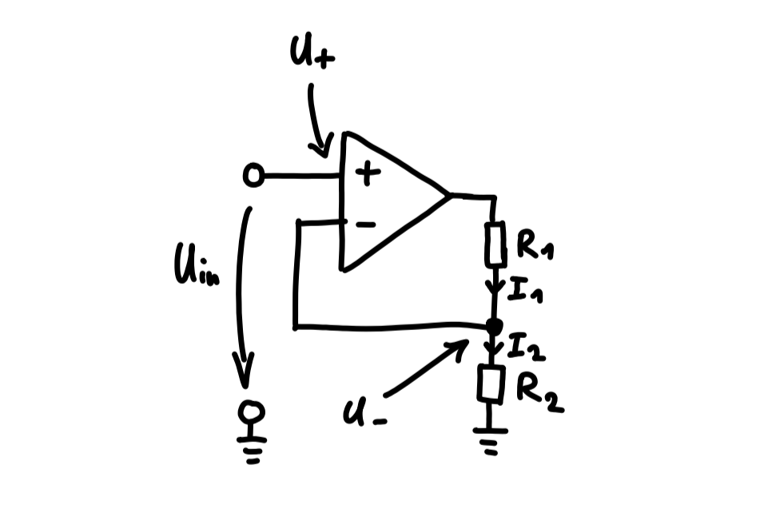

It works as follows: No current can flow into the opamp, so $I_1 = I_2.$ Furthermore, $U_-=U_+=U_{in},$ so $I_1 = I_2 = U_-/R_2 = U_{in}/R_2.$ Hence the current through $R_1$ is completely determined by the input voltage scaled by the fixed value of $R_2.$ In particular, it depends linearly on $U_{in}!$ Note that the value of $R_1$ is completely irrelevant for this calculation. (At least in theory; in practice, the opamp must be able to supply an output voltage big enough so that $U_- = U_+.$ This works as long as the opamp is not in saturation territory.) Thus, we can easily swap $R_1$ with an LED:

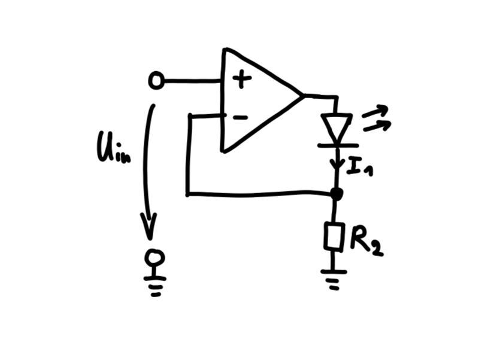

And as such, we have an LED driver where the current through the LED depends linearly on $U_{in}$ and is scaled by the fixed series resistor $R_2.$ Note however, that this works only for positive input voltages, because for a negative input voltage, also $I_2$ and thus $I_1$ would be negative, but this is prevented by orientation of the LED.

In our circuit, we have two LEDs: A yellow one for positive voltages, and a blue one for negative voltages:

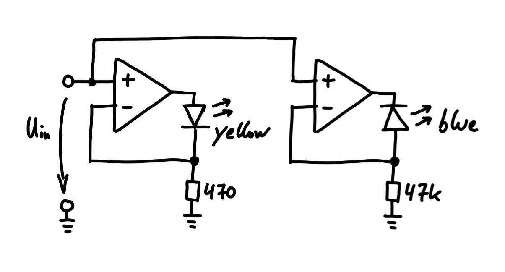

While in theory, one could use on opamp for both LEDs by wiring the LEDs in an antiparallel way in the negative feedback loop, our approach has the upside that the series resistor can be chosen individually for each LED. With the LEDs I have (Standard 3mm LEDs from [banzaimusic.com](banzaimusic.com)), if I use the same series resistor for both LEDs, either the yellow one is barely visible or the blue one kills my eyesight. Through testing on breadboard, I arrived at 470 Ohms for the yellow LED and 47 kOhms for the blue LED.

One last note: When using opamps in such a way that the terminals do not sit at 0V, i.e. (virtual) ground, there is an effect called [phase reversal](https://northcoastsynthesis.com/news/whats-the-deal-with-phase-reversal/). In order to prevent this, we scale the voltage goging to the LED drivers by 1/2, using a simple voltage divider. Since the previous stage can output at most +/-12V, this limits the input of the LED-drivers to +/-6V which is a safe range. Of course, this has to be taken into account when choosing appropriate LED series resistors.

## Output Normalization Mixing

As in the Intellijel Quadratt, I wanted to implement mixing through normalization, i.e. if no cable is plugged into the output jack of some channel, the output signal shall automatically be mixed to the output of the next stage. "Simple!" I thought, naive as I am. "I just add the output of one channel through a 100k-resistor to the first opamp-stage of the next channel." (At this point, you have to recall the basic mixing circuit at the end of the section about inverting opamp stages.) Let's see what happens.

First assume the switch of the next channel is in attenuation mode:

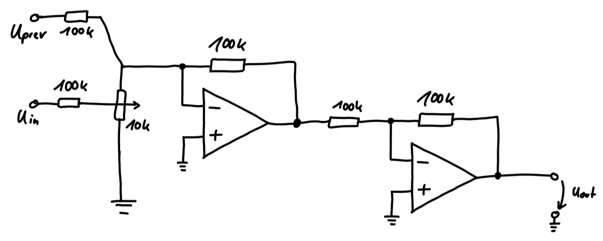

Let $U_{prev}$ be the signal from the previous channel and $V_{in}$ be the input signal of the next channel, which is seen by the first opamp after scaling it with the potentiometer. If the sum of both signals $V_{in}+U_{prev}$ is inside the range of +/-12V, everything works as expected as the first opamp stage outputs $-(V_{in}+U_{prev}),$ which by the second opamp stage gets inverted again to arrive at $V_{in}+U_{prev}$ on the output.

If $V_{in}+U_{prev}$ exceeds the range of +/-12V, then the first opamp saturates. In this case this is no problem, since the excess current at the input can just flow through the pot to ground. So the voltage is just clamped at +/-12V in this case, which is also how the circuit is expected to work.

Now assume we are in attenuvertion mode:

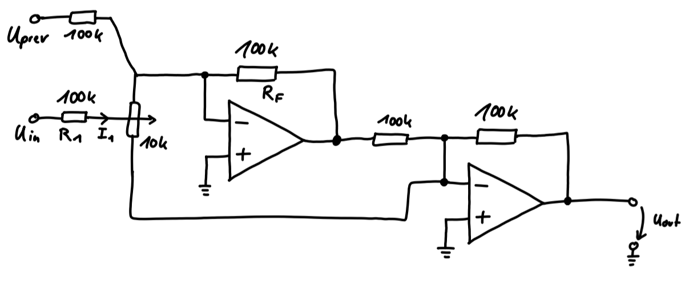

With the notation as above, if $V_{in}+U_{prev}$ does not exceed +/-12V, everything works as before, the only difference being that the input voltage $U_{in}$ is processed by both opamp stages as explained in the previous section about the attenuverter circuit.

If the first opamp goes into saturation, however, there are some drastic effects. Assume that $U_{prev}=12V,$ so this signal alone is enough to saturate the opamp so that its output sits at -12V. Also assume that the pot is fully clockwise, so it can be regarded as a resistance of 10k from the negative terminal of the first opamp to the negative terminal of the second opamp. The current $I_1$ through $R_1$ can now not flow through $R_F,$ since the first opamp is already in saturation and thus cannot go any lower than -12V, which would be necessary to sink more current. Hence, $I_1$ must flow through the pot directly to the second opamp. Suppose we have $U_{in}=5V,$ hence $I_1=5V/100k\Omega = 50\mu A.$ In theory, we would want to have the sum $U_{in}+U_{prev}=17V,$ which gets clamped to 12V, at the total output. But what actually happens is, that the second opamp sees $-12V/100k + 50\mu A = -70\mu A$ at its negative input, hence it outputs 7V, to have a current of $7V/100k\Omega = 70\mu A$ flowing from its output through the feedback resistor to its negative terminal. So, actually $U_{in}$ got subtracted from $U_{prev},$ totally not wat we aimed for!

To overcome this problem we changed the feedback resistor of the first opamp stage from 100k to 51k, effectively halving the voltage gain of this stage. This prevents the opamp from ever going into saturation mode if both $U_{prev}$ and $U_{in}$ stay inside a +/-12V-range. Then the resistor going from the first opamp to the second one also has to be changed to 51k, which has the effect that the second opamp has a gain of -2 for the voltage coming out of the first opamp, which reverses the gain halving we did before. 

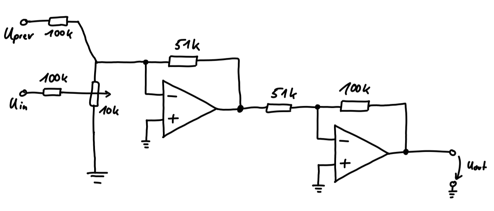

Note that this is of course not necessary for the first channel, as there is normalization mixing in this case. In practice, this approach has the downside that inherent offset voltages as well as noise from the first opamp get amplified by a factor of 2 by the second opamp. But it has to be seen if this is even noticable in practice. -->

# Changes for Next Version

- If Layout has to be changed: Swap all LEDs to the right of their respective output-jack. This should greatly simplify the PCB layout routing.
- Fix positioning of power pinheader